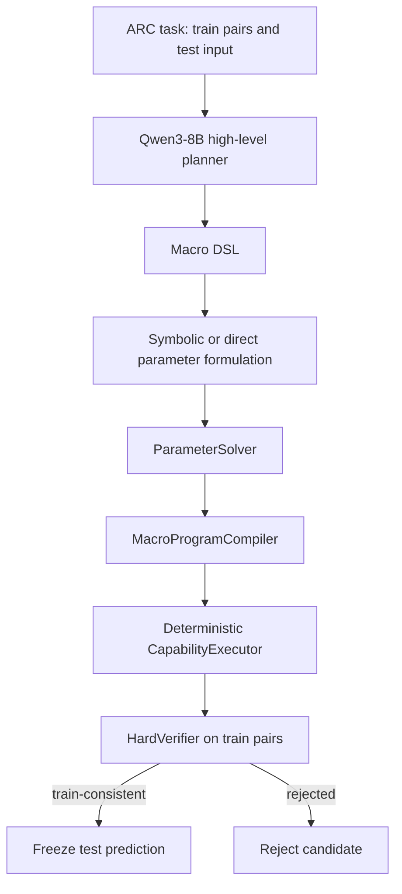

# Verifier-Guided LLM Program Synthesis for Abstract Reasoning

An experimental neuro-symbolic framework for generating, compiling, executing, and deterministically verifying symbolic programs on ARC-style tasks.

> **Research milestone:** V2 frozen Pilot 50 is complete with a **NO_GO** decision. The pipeline operated end to end, but neither frozen condition achieved an exact solve. This repository preserves that negative result.

## Overview

This project asks whether an LLM can solve abstract reasoning tasks more reliably by proposing executable symbolic programs, then submitting them to a deterministic verifier, rather than directly predicting output grids. Program synthesis makes hypotheses inspectable and testable; exact train-pair verification supplies a hard correctness filter.

## System architecture



The low-level capability registry and verifier are deterministic. The LLM proposes hypotheses; it does not select against test solutions.

## Research evolution

**V1 — low-level primitive generation.** The primitive registry grew to roughly 119 capabilities. Schema validity was high, but executable rate was about 0.46%, train-consistent rate was 0%, and exact rate was 0%. The evidence points to API comprehension and parameter inference as the principal bottleneck.

**V2 — Macro DSL and compilation.** V2 raises the planner's abstraction level: Qwen3-8B produces Macro DSL hypotheses, then symbolic/direct parameter handling, compilation, execution, and hard verification are deterministic. The hypothesis was that reducing low-level API burden would improve the executable pathway.

## Experimental protocol

- Development-only iteration and frozen, deterministic task selection.
- No task-ID-specific solver logic or answer patches.
- Inference uses challenge inputs; predictions are frozen before the gated scorer may open solution files.
- Exact train-pair verification, frozen configuration hashes, atomic task checkpoints, and deterministic seeds are recorded.
- Public aggregate results exclude raw model completions, prediction grids, checkpoints, datasets, and model artifacts.

See [Research status](docs/RESEARCH_STATUS.md), [reproducibility notes](docs/REPRODUCIBILITY.md), and the [data exposure audit](reports/data_exposure_audit.md).

## Infrastructure

The V2 pilot used the Qwen3-8B competition model through local offline Transformers inference on Kaggle with four NVIDIA L4 GPUs. Four independent workers were mapped one-to-one to GPUs, with task-level parallelism, atomic checkpoints, and resume/no-duplicate behavior. A fresh-kernel four-way cold-load contention issue was diagnosed and corrected through a sequential artifact warm-up followed by staggered worker initialization.

This is experimental infrastructure, not a claim of solver quality.

## V2 Pilot 50 results

| Condition | Tasks | Wall time | Exact |
| --- | ---: | ---: | ---: |
| Symbolic parameter | 50 | 652.94 s | 0 |
| Direct parameter | 50 | 637.70 s | 0 |

**Decision: NO_GO.** Macro-level symbolic abstraction and deterministic compilation produced a fully operational research pipeline, but the frozen Qwen3-8B V2 Pilot did not achieve exact ARC solves. The appropriate next step is structured failure analysis, not a larger-scale evaluation of this failed configuration. The machine-readable aggregate is [LLM_PROGRAM_SYNTHESIS_V2_PILOT_50.json](experiments/results/LLM_PROGRAM_SYNTHESIS_V2_PILOT_50.json).

## Key findings

- Low-level LLM API interaction was the central V1 bottleneck.
- V2 improved the architecture and verification pathway, but exact task solving remains unresolved.
- Infrastructure is no longer the dominant blocker; hypothesis quality and abstraction alignment are the next targets.
- Negative results are retained rather than hidden.

## Repository layout

- `src/` — ARC data types, representations, deterministic capabilities, compiler, verification, and inference runners.
- `configs/` — capability registries and public, portable experiment protocol descriptions.
- `scripts/` — reproducible experiment and audit entry points; expensive inference is not run by the unit suite.
- `tests/` — deterministic unit and integration tests.
- `experiments/results/` — sanitized aggregate research summaries.
- `reports/` and `docs/` — research, exposure-audit, and reproduction documentation.

Raw datasets, restricted solutions, model weights, checkpoints, generated logs, notebook runtime state, and credentials are intentionally not distributed.

## Reproduction

Python 3.11 or newer is required by the package metadata.

```powershell
python -m venv .venv
.\.venv\Scripts\Activate.ps1
pip install -e ".[dev]"
python -m pytest -q
```

The v0.1.0 V2 Pilot release verified **78 passed**; the current failure-forensics snapshot verifies **91 passed**. Obtain any ARC dataset yourself under its original terms and place it outside version control (for example, `data/raw/`). GPU/model-dependent runs require a separately acquired Qwen3-8B-compatible model and a CUDA-capable environment; see [reproducibility notes](docs/REPRODUCIBILITY.md). Do not use restricted competition solutions for development or scoring outside their permitted environment.

## Current status and roadmap

**Current milestone:** V2 frozen Pilot complete — **NO_GO**.

Planned research, not completed results:

- V2 failure taxonomy and stage-funnel analysis.
- A controlled comparison with an ARC-adapted Qwen3-4B SFT under the same symbolic architecture.
- Verifier-guided iterative repair.
- Only then, consideration of a larger held-out evaluation.

## Research integrity

This repository does not claim state-of-the-art performance, a competition ranking, or that it solves ARC. It uses no task-ID hardcoding, preserves inference-before-solutions gates, protects held-out evaluation, records frozen configurations, and reports negative outcomes.

## Citation and contact

No paper citation is claimed. Please cite this repository by its URL and release tag when referring to this research snapshot.

Third-party assets are not redistributed; see [LICENSE_NOTES.md](LICENSE_NOTES.md).
