# From Verifier-Guided Program Synthesis to Provenance-Aware Test-Time Inference for ARC-AGI

An independent research project on reliable reasoning for ARC-AGI: how to generate, verify, rank, and operationally run candidate grid-transformation programs when correct answers are unavailable at inference time.

**What is original here.** This repository develops the experimental design and implementation around a typed symbolic/RuleSpec path, evidence extraction and deterministic execution, hard train-pair verification, reversible augmentation search, candidate provenance and deduplication, ranking diagnostics, frozen-cohort protocols, and a resumable multi-GPU inference system. It does **not** claim authorship or training of the public Qwen/NVARC-derived checkpoints used in several experiments.

**Strongest held-out evidence.** On one 60-task cohort frozen before inference and target access, provenance-aware method B achieved 21/60 two-attempt exact solves versus 18/60 for method A (+3 net; exact paired two-sided binomial \(p=0.375\)). This is a directional result with limited power, not a statistical-significance or competition-performance claim. The same study found 30/60 candidate recall for both methods, isolating selection as a separate bottleneck. [Full audit](docs/RESEARCH_AUDIT.md) · [canonical experiment index](docs/EXPERIMENT_INDEX.md)

## Research question

Can a system that separates hypothesis generation from deterministic execution, train-pair verification, and provenance-aware selection make ARC-style test-time inference more reliable and diagnosable under fixed compute budgets?

## Why ARC-AGI

ARC tasks require inferring a transformation from a small number of input/output examples and producing output grids for unseen inputs. Their small-data structure makes it useful to distinguish representation, candidate generation, verification, and ranking failures rather than reporting only a final accuracy. ARC is the benchmark context for this work, not merely a competition target. See Chollet's original ARC proposal and the current [ARC Prize competition](https://arcprize.org/competitions/2026/arc-agi-2).

## Main contributions

- Designed a progression from bounded symbolic libraries and macro program synthesis to an evidence → RuleSpec → executor → hard-verifier architecture.
- Built deterministic, typed execution and train-pair hard verification so candidate claims can be inspected independently of the neural generator.
- Introduced reversible augmentation, exact-output deduplication with provenance, and fixed two-attempt selection protocols for candidate portfolios.
- Used frozen, target-blind cohorts and post-freeze scoring to separate candidate recall, Top-1 ranking, and two-attempt exact success.
- Implemented checkpointed multi-worker inference and evaluated a dynamic 4-worker scheduler by CPU-only replay of frozen task runtimes.

## System architecture

```mermaid
flowchart LR
  A[Task train pairs + test input] --> B[Candidate generators]
  B --> C[Symbolic / RuleSpec path or native grid candidates]
  C --> D[Deterministic executor]
  D --> E[Hard train-pair verifier]
  E --> F[Deduplicate + retain candidate provenance]
  F --> G[Train-only likelihood / fixed selection]
  G --> H[Freeze one or two distinct test attempts]
  H --> I[Separate exact scoring, when labels are permitted]
```

The verifier is a hard consistency filter over training pairs; it is not a proof that a selected test output is correct. Candidate ranking never accesses test targets in the frozen protocols documented here.

## Research journey

1. **Bounded symbolic libraries.** Whole-grid, object, relation, and pattern libraries established small but interpretable train-only baselines. They exposed coverage limits rather than yielding a general ARC solver.
2. **LLM program synthesis failure analysis.** Low-level program generation showed high schema validity but 0% train consistency in frozen LLM conditions; the Macro DSL improved interface control but initially remained blocked by semantic grounding and parameter handling.
3. **RuleSpec semantics.** The V3 representation separates evidence, rule recognition, parameter binding, deterministic execution, and verification. A train-only construction audit recovered 10/30 exact training coverages from 3/30 without reading test outputs; it is not end-to-end held-out accuracy.
4. **Native neural candidate search.** Public ARC-specialized Qwen-derived inference with reversible views generated diverse candidate pools. This made candidate recall versus selection measurable.
5. **Selection and deployment.** Multi-view likelihood, provenance-aware aggregation, fixed two-attempt policies, frozen cohorts, TTT safety gates, and dynamic scheduling focus on reliable test-time operation rather than model retraining.

## Experimental methodology

Every scored cohort has a stated scope. In the stronger frozen studies, task IDs and method configuration were committed or hashed before inference; candidate pools and selected attempt ranks were frozen before solution files were opened. Results are never merged across cohorts.

| Cohort / artifact | N | Method | Metric | Result | Status / caveat |
| --- | ---: | --- | --- | ---: | --- |
| Symbolic library v0 | 1,000 training tasks | bounded whole-grid primitives | exact | 14/1,000 | train-only baseline |
| V2 Pilot 50 | 50 + 50 | Qwen3-8B Macro DSL, symbolic/direct parameter routes | exact | 0/50 each | frozen pilot; retained negative result |
| V3 construction push | 30 | complete RuleSpec, train-only hard verification | exact train coverage | 10/30 (from 3/30) | representation audit, not E2E test accuracy |
| frozen30 diagnostic | 25 complete tasks | A/B/C/D candidate-search/selection ablation | Any-of-K / Top-1 / two attempts | D: 22/25 / 9/25 / 13/25 | partial diagnostic cohort; C was stopped before five tasks |
| untouched60 | 60 | A vs provenance-aware B | two attempts | A 18/60; B 21/60 | target-blind frozen A/B, paired \(p=0.375\) |
| dynamic scheduler replay | 60 | static vs dynamic four-worker assignment | makespan | 7,557.76 s → 5,564.09 s | CPU-only replay of frozen runtimes |

See [the complete evidence table](docs/RESEARCH_AUDIT.md) for sources, confidence, and qualification of every claim.

## Key results and failure analysis

The central empirical observation is deliberately narrow: **a correct candidate in the pool is not equivalent to a solved task.** On frozen30 forensics, correct candidates existed for 21/30 tasks while likelihood Top-1 was exact for 9/30; median correct-candidate rank was 2. On untouched60, both A and B retained 30/60 diagnostic Any-of-K recall, but B changed two-attempt exact success from 18/60 to 21/60. These results support studying portfolio selection separately from candidate generation; they do not establish broad causal or statistically significant superiority.

Negative results remain part of the record: the V2 Macro DSL pilot had zero exact solves, a public ARC-SFT checkpoint was weak alone on a 30-task development diagnostic, and robust multi-view likelihood did not improve Top-1 on its one eight-task untouched evaluation despite improving some rank diagnostics.

## Test-time inference pipeline

The current production-oriented path uses a public, pretrained ARC-specific Qwen-derived checkpoint through Transformers. It serializes grids in the verified NVARC-compatible contract, applies predeclared reversible augmentations, decodes bounded candidate branches where configured, deduplicates exact grid outputs while retaining origin support, scores with fixed train-only likelihood features, and emits two distinct attempts in a predeclared order. The repository’s original contribution is the surrounding research and inference system, not checkpoint training.

## Multi-GPU production system

The runner supports complete model instances per L4, atomic task checkpoints, resume/no-duplicate behavior, deterministic task identity, and a dynamic shared queue. A 60-task historical replay estimates that dynamic assignment would reduce makespan by 26.38% (7,557.76 s to 5,564.09 s) and increase estimated utilization from 72.81% to 98.90%. Because this is a replay of frozen task times, it is systems evidence rather than a live throughput benchmark; inference semantics are unchanged.

## Reproducibility

Start with [REPRODUCIBILITY.md](REPRODUCIBILITY.md). The public CPU test suite can be run without datasets or models. GPU studies require separately obtained data and public checkpoints under their respective terms; raw solutions, weights, prediction files, and private Kaggle artifacts are intentionally not redistributed.

## Repository structure

- `src/` — symbolic representations, evidence extraction, executor/verifier, inference and scheduler code.
- `configs/` — frozen protocols, model-interface provenance, and experiment configuration.
- `experiments/results/` — versioned, sanitized aggregate results.
- `artifacts/` — local/private detailed artifacts; not all are versioned because they may contain restricted data or outputs.
- `reports/` — contemporaneous experimental reports, including negative findings.
- `docs/` — research audit, paper draft, portfolio material, and experiment index.
- `tests/` — CPU-oriented unit and integration tests.

## External resources and attribution

ARC data and ARC Prize materials are external. The native inference work uses public Qwen/NVARC-derived assets where recorded in [`configs/NVARC_NATIVE_INTERFACE_846D0198_PROVENANCE.json`](configs/NVARC_NATIVE_INTERFACE_846D0198_PROVENANCE.json); the repository reimplements selected interface/search ideas and does not redistribute model weights or represent them as author-trained. PyTorch, Transformers, Kaggle, and their respective licenses govern their own components. See [LICENSE_NOTES.md](LICENSE_NOTES.md) and the paper references.

## Limitations

- Diagnostic cohorts are small, and the untouched60 A/B difference is not statistically significant by the recorded paired exact test.
- Candidate recall, Top-1, and two-attempt exact success are distinct; the selector remains a principal bottleneck.
- Results depend on public pretrained ARC-specific checkpoints and on constrained compute.
- Train-only representability audits do not demonstrate end-to-end generalization.
- Historical scheduler evidence is a replay, not a new live benchmark.
- Internal diagnostics and competition hidden tests differ; no public leaderboard result, rank, or medal is claimed.

## Competition status

**ARC Prize 2026**

| Field | Status |
| --- | --- |
| Public LB | Pending |
| Final rank | Pending |
| Medal | Pending |

## Current status

This is a research preprint and portfolio package, not a peer-reviewed publication and not a claim of an effective general ARC solver. The immediate research question is how to improve target-blind selection without contaminating frozen evaluation.

## Citation

If you refer to this repository, use [`CITATION.cff`](CITATION.cff). No repository-wide license is asserted; see [LICENSE_NOTES.md](LICENSE_NOTES.md).
